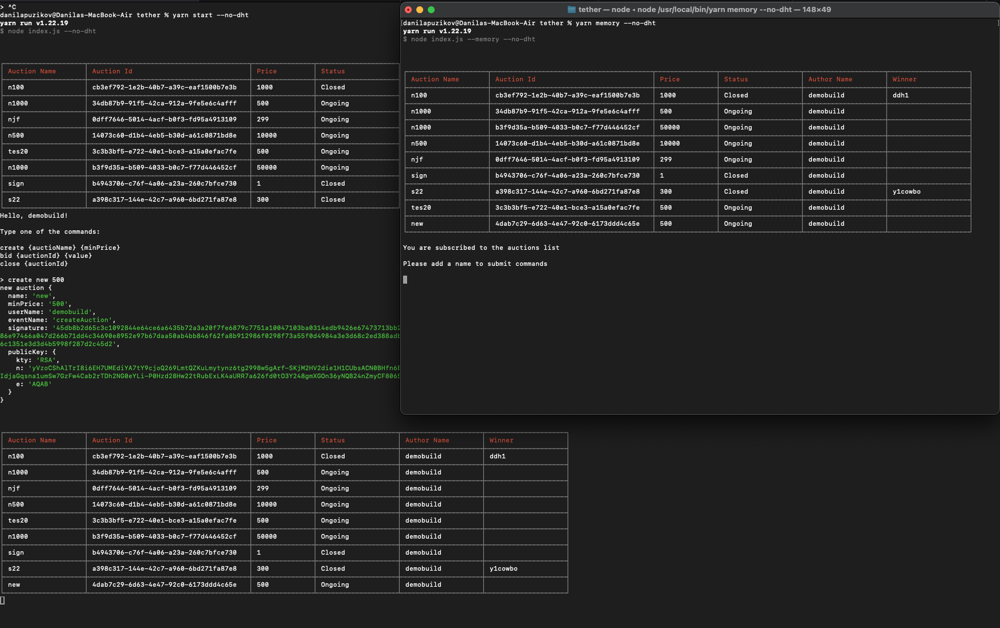

- open terminal
- start dht
- open another terminal
- npm i
- npm start
- copy serverPubKey from output of server
- paste serverPubKey to client.js
- open second terminal
- npm run client
- run some commands
- enjoy
- see todo in index.js line 209
  
